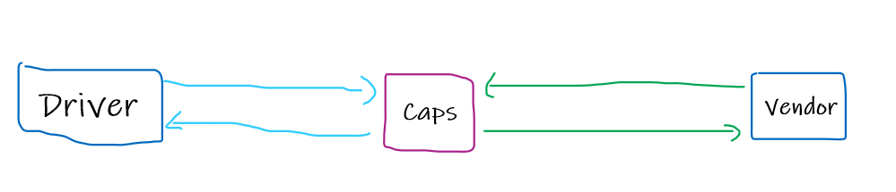

# caps

[GitHub actions link](https://github.com/bahazghayar/caps/actions)  

[Pull request link](https://github.com/bahazghayar/caps/pull/1)  

### For working on the same project:
1. clone the repo
2. install the dependencies `npm i dotenv jest faker`
3. change the package.json file to
                        "scripts": {
                            "start": "node caps.js",
                            "watch": "nodemon",
                            "test-watch": "jest --watchAll",
                            "test": "jest --coverage --verbose"
                        }

### UML

### Collaboration
1. Afnan Damra
2. Zaid Al Asfar